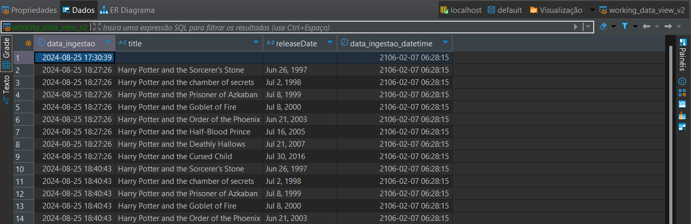

## Data Pipeline - Harry Potter API Integration

### Visão Geral 
Este projeto é um pipeline de dados que integra informações da API do Harry Potter com um armazenamento colunar (ClickHouse) e um sistema de armazenamento de objetos (MinIO). Ele permite que os dados sejam processados e armazenados de maneira eficiente para posteriores consultas e análises.
<br>

### Pré-Requisitos:
Antes de iniciar a configuração e execução do projeto, certifique-se de que você tem as seguintes ferramentas instaladas em seu ambiente:

- Docker e Docker Compose: Necessários para orquestrar os serviços de ClickHouse e MinIO.
- Python 3.12 (ou superior): Necessário para rodar o código Python.
- Poetry: Gerenciador de dependências para Python, utilizado para instalar as bibliotecas e rodar o projeto.

### Configuração Inicial:
##### 1. Clonar o Repositório
Clone o repositório para o seu ambiente local:
```bash
git https://github.com/JuliaTogni/data_pipeline.git
```

##### 2. Configurar o Ambiente Docker
O projeto utiliza Docker Compose para configurar e iniciar o ClickHouse e o MinIO. Esses serviços são necessários para armazenar e gerenciar os dados processados.

- ClickHouse: É um banco de dados colunar.
- MinIO: Um sistema de armazenamento de objetos similar ao S3.

Para iniciar os serviços, execute o seguinte comando na raiz do projeto: <br>
```bash
docker compose up --build
```
Isso iniciará o ClickHouse e o MinIO, preparando o ambiente para armazenar e processar os dados da API.

##### 3. Instalar as dependências
Com o Docker configurado, você precisará instalar as dependências do projeto. Nesse caso, isso é feito utilizando o Poetry:
```bash
poetry install
```
Este comando instalará todas as dependências necessárias, garantindo que o ambiente Python esteja configurado corretamente para rodar o código.

### Executando o projeto
##### 1. Iniciar a Aplicação
Após configurar o ambiente, você pode iniciar a aplicação Python:
```bash
poetry run python app.py
```

##### 2. Verificação Automática de Dados
Ao iniciar, o projeto verificará automaticamente se os dados da API de Harry Potter já estão presentes no MinIO:

- Dados Presentes: Se os dados já existirem, eles serão carregados e processados diretamente.
- Dados Ausentes: Se os dados não estiverem presentes, o pipeline fará uma requisição à API do Harry Potter, armazenará os dados no MinIO, e realizará o processamento e armazenamento no ClickHouse.

##### 3. Realizar Requisições
Com a aplicação em execução, você pode realizar requisições para o endpoint /data da API localmente hospedada.
###### Exemplo de requisição
```bash
http://localhost:5000/data
{
    "endpoint": "/books"
}
```
Essa requisição acionará o pipeline para buscar dados específicos da API de Harry Potter e processá-los.
###### Exemplo de resposta
```bash
{
    "message": "Dados da API de Harry Potter processados e armazenados com sucesso"
}
```

##### 4. Visualização dos Dados no ClickHouse
Após a execução do pipeline, os dados são armazenados no ClickHouse e podem ser visualizados de uma forma organizada e estruturada. Abaixo está um exemplo de como os dados são visualizados:
```bash
CREATE VIEW IF NOT EXISTS working_data_view AS
SELECT
    data_ingestao,
    JSONExtract(dado_linha, 'title', 'String') AS title,
    JSONExtract(dado_linha, 'releaseDate', 'String') AS releaseDate,
    toDateTime(JSONExtractInt(dado_linha, 'data_ingestao') / 1000) AS data_ingestao_datetime
FROM working_data;
```
###### Exemplo do resultado
| data_ingestao       | title                                          | releaseDate  | data_ingestao_datetime |
|---------------------|------------------------------------------------|--------------|------------------------|
| 2024-08-25 17:30:39 | Harry Potter and the Sorcerer's Stone           | 1997-06-26   | 2024-08-25 17:30:39    |
| 2024-08-25 17:30:39 | Harry Potter and the Chamber of Secrets         | 1998-07-02   | 2024-08-25 17:30:39    |
| 2024-08-25 17:30:39 | Harry Potter and the Prisoner of Azkaban        | 1999-07-08   | 2024-08-25 17:30:39    |




##### 5. Executar Testes Automatizados
O projeto possui testes automatizados para garantir a integridade das funcionalidades desenvolvidas. Para rodar todos os testes, use o seguinte comando:
```bash
poetry run pytest
```
Isso executará os testes definidos na pasta **tests/**.
###### Evidência realização dos testes:
